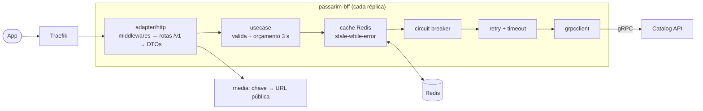

# passarim-bff

BFF REST/JSON do [Passarim](https://github.com/velosobr/passarim-docs): expõe o catálogo de aves em `/v1` para o
app e fala com a Catalog API por gRPC, com cache Redis (stale-while-error), circuit breaker, retry, rate limit por IP
e observabilidade (logs `slog`, métricas Prometheus, traces OpenTelemetry). O BFF nunca chama APIs externas: o catalog
devolve só **chaves** de mídia e o BFF monta as URLs públicas.

## Arquitetura

Dependências apontam para dentro (`domain` ← `usecase` ← `adapter`). Cada preocupação da cadeia de resiliência é um
decorator sobre a porta `usecase.CatalogReader`, testável com um `CatalogReader` falso.

## Comandos

| Comando | O que faz |
|---|---|
| `make test` | testes unitários, de contrato (`openapi.yaml`) e de integração com Redis (precisa de Docker) |
| `make lint` | `golangci-lint` (inclui gosec) |
| `make e2e` | teste ponta a ponta com o catalog real (só local; constrói o catalog de `../passarim-catalog`) |
| `make swagger` | gera `docs/swagger.html` (Swagger UI) a partir do `openapi.yaml`; abra no navegador |
| `make run` | roda o BFF local contra o catalog e o Redis do `docker compose` do `passarim-docs` |

## Contrato e design

- Contrato REST: [`openapi.yaml`](openapi.yaml) (validado por teste de contrato com `kin-openapi`).
- Spec de design: [`passarim-bff-design`](https://github.com/velosobr/passarim-docs/blob/main/docs/superpowers/specs/2026-10-03-passarim-bff-design.md).
- ADRs: [0015 (rate limit)](https://github.com/velosobr/passarim-docs/blob/main/docs/adr/0015-rate-limit-em-memoria-por-replica.md)
  e [0016 (cache e stale-while-error)](https://github.com/velosobr/passarim-docs/blob/main/docs/adr/0016-cache-com-envelope-e-stale-while-error.md).

## Configuração (variáveis de ambiente)

Mensagens de erro citam o **nome** da variável, nunca o valor.

| Variável | Obrigatória | Padrão | Uso |
|---|---|---|---|
| `HTTP_ADDR` | não | `:8080` | Porta da API e do health |
| `METRICS_ADDR` | não | `:9091` | Porta do `/metrics` |
| `CATALOG_ADDR` | sim | — | Endereço gRPC do catalog |
| `CATALOG_TLS_CA_FILE` | não | — | CA para validar o catalog; presente = TLS ligado |
| `CATALOG_TLS_CERT_FILE` / `CATALOG_TLS_KEY_FILE` | não | — | Certificado de cliente (mTLS futuro); os dois juntos ou nenhum, e só com `CATALOG_TLS_CA_FILE` |
| `CATALOG_TLS_SERVER_NAME` | não | host de `CATALOG_ADDR` | Nome esperado no certificado do catalog |
| `REDIS_URL` | sim | — | `redis://...` |
| `REDIS_TIMEOUT` | não | `100ms` | Timeout de cada operação no Redis |
| `MEDIA_BASE_URL` | sim | — | URL absoluta `http`/`https` à qual a chave de mídia é anexada |
| `REQUEST_BUDGET` | não | `3s` | Orçamento total por requisição |
| `CATALOG_ATTEMPT_TIMEOUT` | não | `2s` | Timeout por tentativa |
| `CATALOG_MAX_RETRIES` | não | `2` | Retries além da 1ª tentativa |
| `CACHE_FRESH_TTL` | não | `10m` | Frescor do cache |
| `CACHE_STALE_TTL` | não | `24h` | TTL no Redis (janela de stale) |
| `RATE_LIMIT_RPS` / `RATE_LIMIT_BURST` | não | `10` / `30` | Token bucket por IP |
| `RATE_LIMIT_MAX_IPS` | não | `10000` | Teto de IPs rastreados |
| `TRUSTED_PROXIES` | não | vazio | CIDRs separados por vírgula |
| `CLIENT_IP_HEADER` | não | `X-Forwarded-For` | Cabeçalho com o IP do cliente |
| `SHUTDOWN_DRAIN_DELAY` | não | `3s` | Espera com `/readyz` em 503 |
| `SHUTDOWN_TIMEOUT` | não | `10s` | Prazo do `Shutdown` |
| `LOG_LEVEL` | não | `info` | `debug`, `info`, `warn`, `error` |
| `OTEL_EXPORTER_OTLP_ENDPOINT` | não | vazio (tracing desligado) | Ex.: `http://jaeger:4317` |
| `OTEL_SERVICE_NAME` | não | `passarim-bff` | Nome do serviço nos traces |

## Limitações conhecidas

- **Janela de URLs de mídia quebradas:** quando o worker troca a mídia de uma espécie, ele apaga os objetos antigos
  depois de o banco apontar para os novos. O BFF pode continuar servindo a URL velha por até ~10 min (frescor do cache)
  + 60 s (`max-age` no app), ou enquanto servir dado velho com o catalog fora do ar.
- **Rate limit por réplica:** o limite é em memória em cada réplica; com 2 réplicas e round-robin um IP consegue até ~2×
  o limite (ADR-0015). Cada endereço IPv6 conta como um balde.
- **IP compartilhado no ambiente local:** com as portas publicadas em `127.0.0.1`, os clientes do host chegam ao Traefik
  com o IP do gateway do Docker e dividem o mesmo balde de rate limit.
